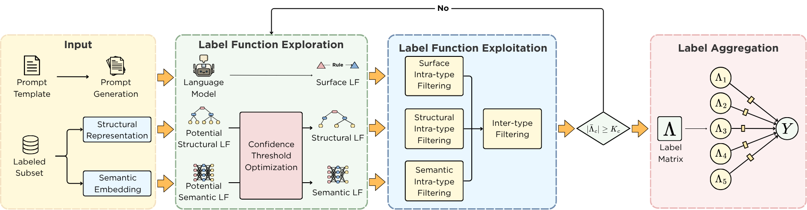

<div align="center">

# EXPONA: Structured Exploration and Exploitation of Label Functions for Automated Data Annotation
[](https://opensource.org/licenses/MIT)
[](https://github.com/iSE-UET-VNU/EXPONA.git)
[](https://www.python.org/downloads/release/python-31312/)
[](https://doi.org/10.1016/j.knosys.2026.115843)
</div>



## Introduction
In this paper, we introduce EXPONA, a powerful, automated framework for programmatic labeling that generates and refines label functions (LFs) to create high-quality training datasets. By systematically exploring heuristics across surface, structural, and semantic perspectives, and selecting the most reliable ones, EXPONA reduces noise and redundancy in weak labels. This approach streamlines data annotation and improves model performance in a wide range of text classification tasks.

## Installation
To install `Expona` from the github repository main branch, run:
```bash
git clone https://github.com/iSE-UET-VNU/EXPONA.git
cd EXPONA
conda create -n expona python==3.12
conda activate expona
cp .env.example .env
pip install -e .
```

## Quickstart
All datasets should be stored inside the `./data` directory. For convenience, you can directly download public datasets via [Kaggle Dataset](https://www.kaggle.com/datasets/phonglmnguynduy/expona-datasets/data).

If you want to use **your own dataset**, register it in `./wrench/dataset/__init__.py` by adding its name and comply with the [Wrench](https://github.com/JieyuZ2/wrench) format. Each split (`train`, `valid`, `test`) should be a JSON file with the following structure:

```json
{
  "0": { "data": { "text": "sample text" }, "label": 1 },
  "1": { "data": { "text": "another sample" }, "label": 0 }
}
```

To run our experiments:
```bash
python main.py \
  --dataset imdb \
  --surface_lf_model openai/gpt-4.1 \
  --min_lf_per_type 20 \
  --max_patience 5 \
  --alpha 0.9 \
  --beta 0.1 \
  --verbose
```

## Citation
If you're using `Expona` in your research or applications, please consider citing our paper:

```
@article{lam2026structured,
title = {Structured Exploration and Exploitation of Label Functions for Automated Data Annotation},
author = {Phong Lam, Ha-Linh Nguyen, Thu-Trang Nguyen, Son Nguyen, Hieu Dinh Vo},
doi = {https://doi.org/10.1016/j.knosys.2026.115843},
journal = {Knowledge-based systems},
publisher={Elsevier},
year = {2026},
}
```

If you have any questions, comments, or suggestions, please do not hesitate to contact us.
- Email: 22028164@vnu.edu.vn or duyphong.uet@gmail.com
